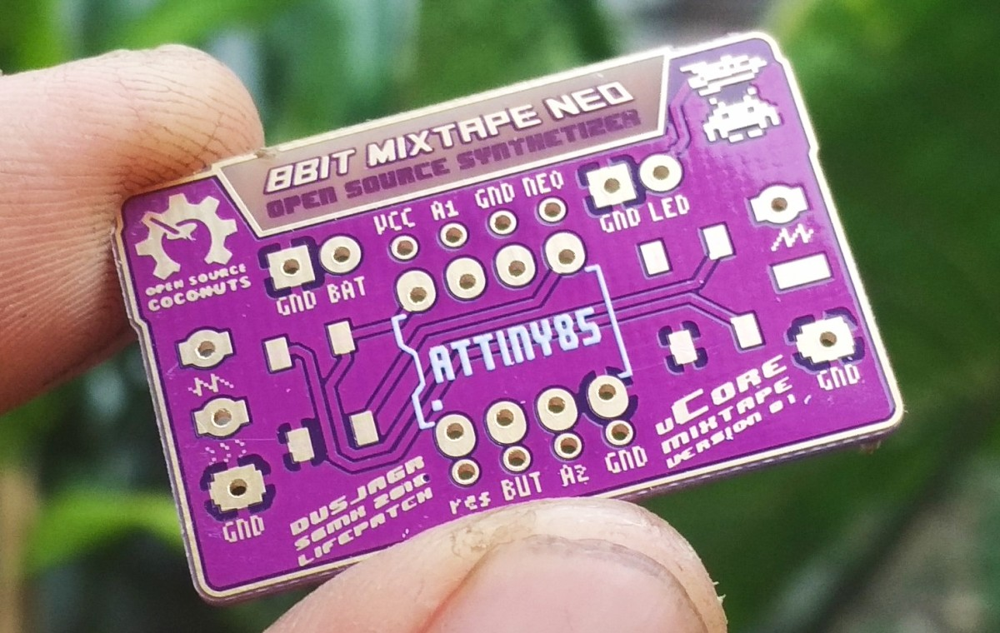
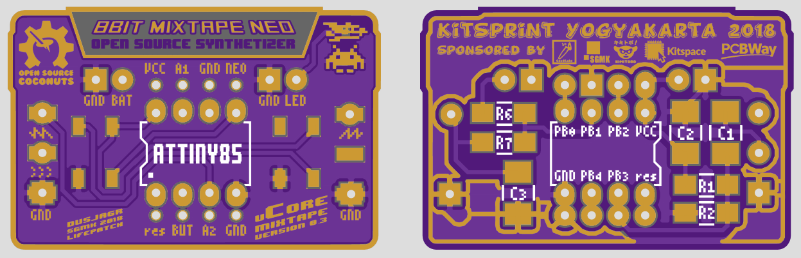
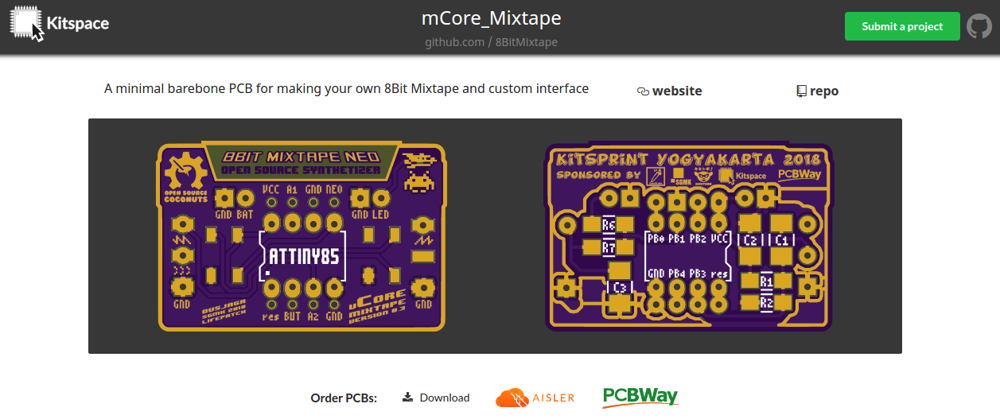

# mCore_Mixtape
A minimal barebone PCB for making your own 8Bit Mixtape and custom interface

# Gerber files v0.3 ready for manufacturing

# See/order on Kitspace

https://kitspace.org/boards/github.com/8bitmixtape/mcore_mixtape/

